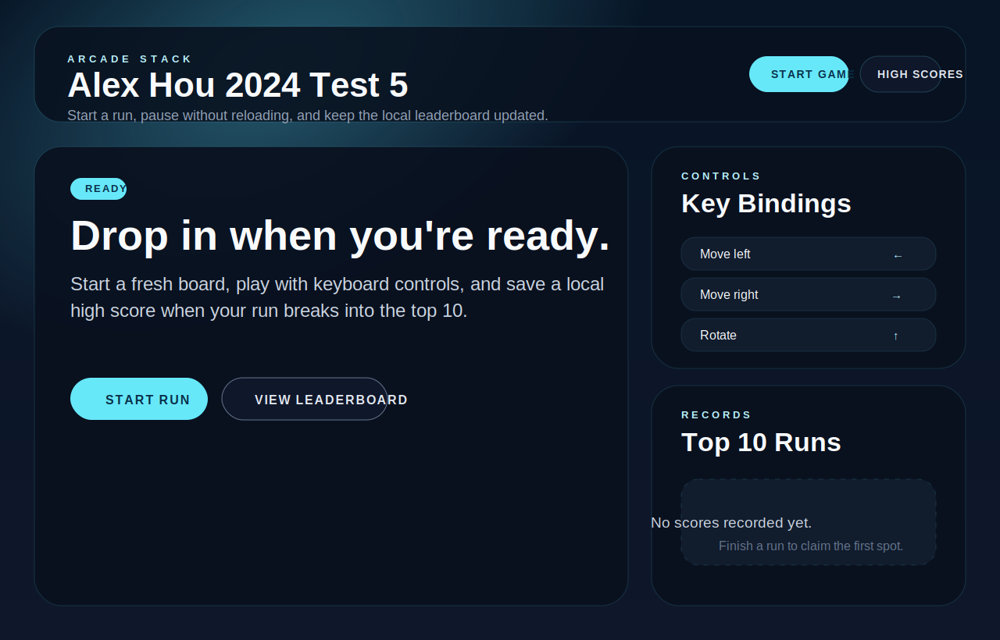
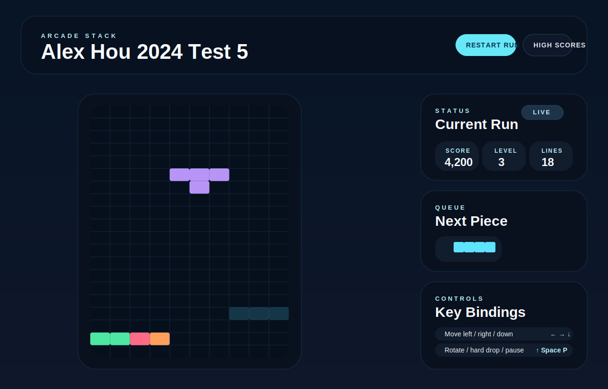
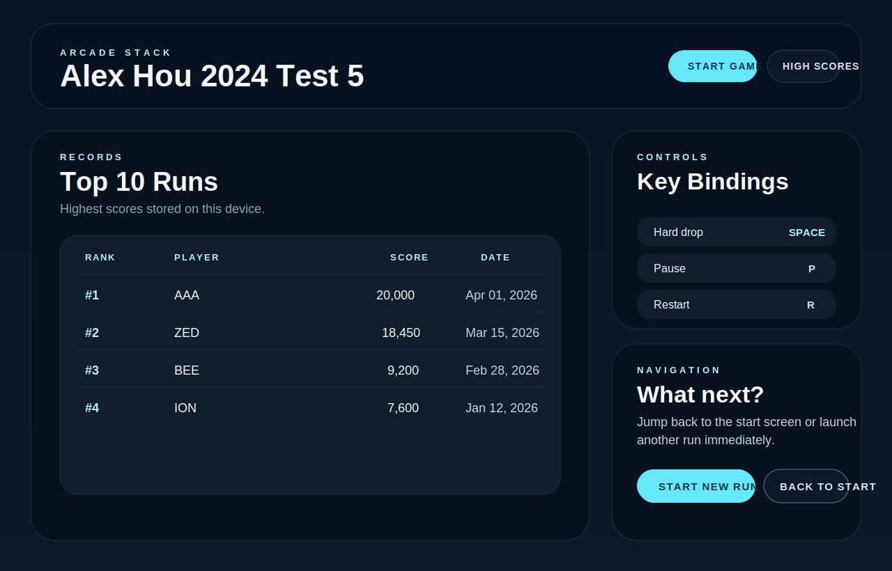

# Alex-Hou-2024-test-5

A browser-based Tetris implementation built with Vite, React, TypeScript, Tailwind CSS, and a reducer-driven game engine. The app includes a start screen, live gameplay with keyboard controls, pause and game-over overlays, and a local top-10 leaderboard backed by `localStorage`.

## Screenshots

### Start screen



### Gameplay



### High scores



## Features

- Pure engine modules for tetromino definitions, movement, collision, gravity, scoring, spawn logic, and reducer-based state transitions.
- Canvas-rendered board with active piece, ghost piece, and next-piece preview.
- Keyboard controls with DAS-style repeat timing for left, right, and soft drop.
- Start, play, pause, game-over, and high-scores screens wired through the top-level app without full-page reloads.
- Local top-10 high-score storage with initials entry for qualifying runs.
- Dockerized production build served from `nginx:alpine` with SPA fallback support.

## Requirements

- Node.js `22.x`
- npm `10.x` or newer
- Optional: Docker for the production container workflow

## Local development

Install dependencies:

```bash
npm install
```

Create a local env file:

```bash
cp .env.example .env
```

Start the dev server on `0.0.0.0:8080`:

```bash
npm run dev
```

Open `http://localhost:8080`.

## Environment variables

This app reads Vite-exposed environment variables from `.env` files.

| Variable | Required | Description |
| --- | --- | --- |
| `VITE_APP_TITLE` | No | Overrides the app title shown in the browser tab and header. Defaults to `Alex Hou 2024 Test 5`. |

Example `.env.example`:

```bash
VITE_APP_TITLE=Alex Hou 2024 Test 5
```

## Available scripts

| Command | Description |
| --- | --- |
| `npm run dev` | Starts the Vite dev server on `0.0.0.0:8080`. |
| `npm run build` | Runs TypeScript project builds and outputs a production bundle to `dist/`. |
| `npm run preview` | Serves the built app on `0.0.0.0:8080`. |
| `npm run lint` | Runs ESLint across the project. |
| `npm run test -- --run` | Runs the Vitest suite once. |
| `npm run format` | Formats the project with Prettier. |

## Build and test

Run the production build:

```bash
npm run build
```

Run linting:

```bash
npm run lint
```

Run the test suite:

```bash
npm run test -- --run
```

## Controls

| Key | Action |
| --- | --- |
| `←` | Move left |
| `→` | Move right |
| `↑` | Rotate clockwise |
| `↓` | Soft drop |
| `Space` | Hard drop |
| `P` | Pause / resume |
| `R` | Restart current run |

## High scores

- The app stores the local top 10 runs in `localStorage` under `tetris.highScores`.
- A game-over score prompts for initials only when it qualifies for the leaderboard.
- Initials are sanitized to three uppercase letters before save.

## Docker

Build the production image:

```bash
docker build -t alex-hou-2024-test-5 .
```

Run the container on `0.0.0.0:8080`:

```bash
docker run --rm -p 8080:8080 alex-hou-2024-test-5
```

The container uses a multi-stage build:

- `node:22-alpine` installs dependencies and builds the Vite app.
- `nginx:alpine` serves the static assets from `dist/`.

The nginx configuration listens on port `8080`, caches `/assets/` aggressively, and routes unknown paths back to `index.html` for SPA navigation.

## Manual smoke-test checklist

Run the checklist in both Chrome and Firefox against a local `npm run dev` session.

1. Start at the landing screen and confirm the title, Start Run button, View Leaderboard button, controls panel, and leaderboard panel render without layout overlap.
2. Resize the browser to a typical desktop width and confirm the board area and side panels stay readable without horizontal scrolling.
3. Start a new run and confirm the board, HUD, next-piece preview, and controls panel appear on one screen.
4. Verify keyboard controls:
   `Left`/`Right` move the active piece, `Up` rotates, `Down` soft-drops, `Space` hard-drops, `P` pauses, and `R` restarts.
5. Press `P` during play and confirm the pause overlay appears; press `P` again and confirm play resumes.
6. Force a game over and confirm the modal appears above the board, shows the final score, and the Play Again button restarts without reloading the page.
7. From the game-over modal, open High Scores and confirm the app routes to the leaderboard screen without a reload.
8. Trigger a qualifying score and confirm the initials form appears, accepts only three letters, saves successfully, and updates the local top-10 table.
9. Trigger a non-qualifying score after the leaderboard is full and confirm the initials form does not appear.
10. From the High Scores screen, verify both Start New Run and Back To Start work without reloading the page.

Support checks performed in this VM:

1. `npm run build`
2. `npm run lint`
3. `npm run test -- --run`

Browser note:

- The Sprite VM used for repository automation does not include the system libraries needed to launch Playwright’s Chromium or Firefox binaries, so the browser-specific smoke checklist above must still be executed in a local desktop environment.
